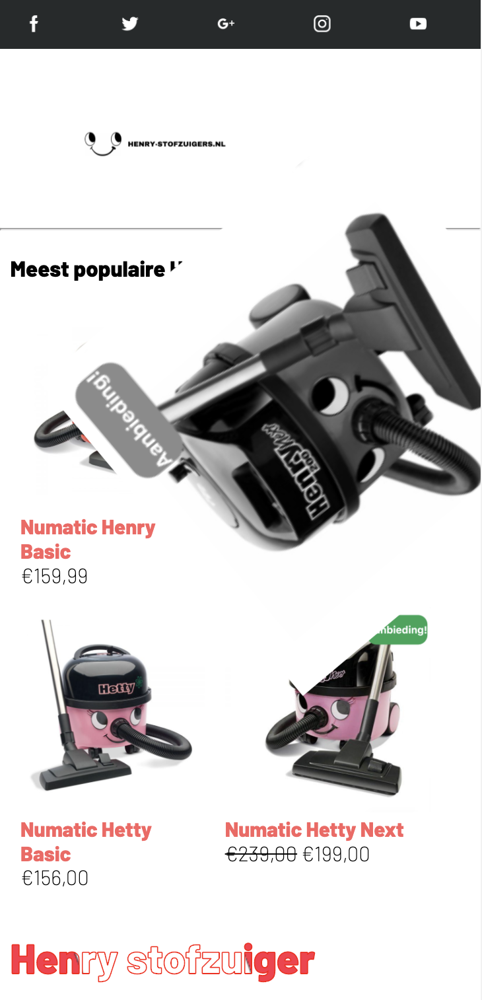
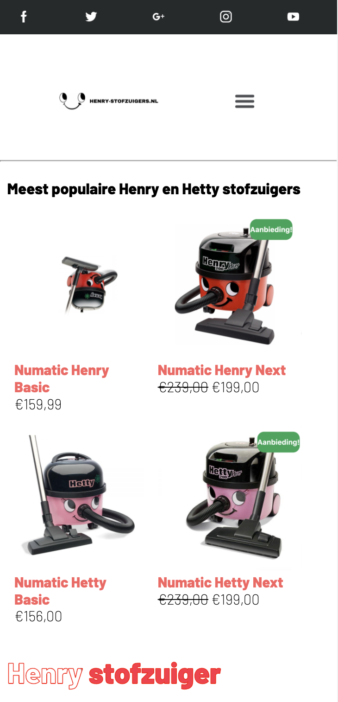
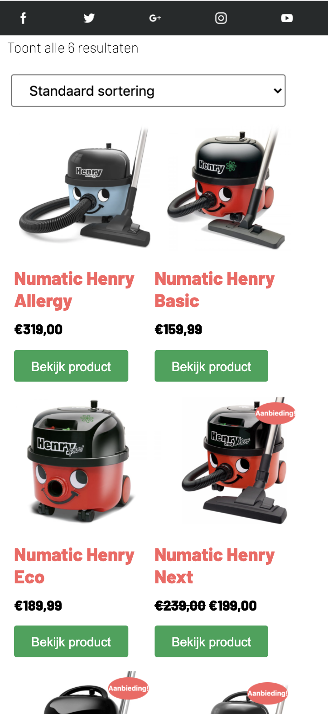
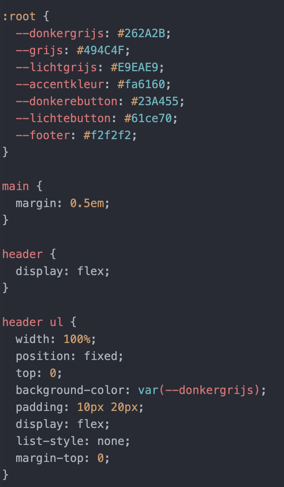

# Procesverslag
**Auteur:** -Milou Teeuwen-

## Bronnenlijst
1. https://www.youtube.com/watch?v=_CR0LVaGIQI
2. https://www.aartjan.nl/css/index.html
3. https://flexbox.io
4. https://css-tricks.com/snippets/css/a-guide-to-flexbox/
5. https://www.w3schools.com/css/css_align.asp
6. https://developer.mozilla.org/nl/docs/Web/JavaScript/Reference/Global_Objects/Array
7. https://www.w3schools.com/howto/howto_css_image_center.asp
8. https://www.w3schools.com/TAgs/tryit.asp?filename=tryhtml_link_target

## Intake (week 1)

**Je startniveau:** -blauw-

**Je focus:** -surfice plane: annimation-

**Je opdracht:** -https://henry-stofzuigers.nl

**Screenshot(s):**

## les 1 (week 1)
**voortgang/uitdaging**
ik kies voor deze website omdat ik heel veel van dieren hou, en de site wel een opknap beurt kan gebruiken. De dingen die ik wil verbeteren zijn de vierkante blokken en weinige afbeeldingen. de slider in het begin met doneer nu zou ik graag zelf kunnen maken. Verder denk ik dat de uitdaging zit in de site mooier maken. ik had in het begin gekozen voor de apple site, maar de kans dat ik dat niet volledig na kan maken is heel groot. Door een website te kiezen die ik kan verbeteren denk ik dat ik er meer energie uit haal. In de typografie oefening heb ik veel geoefend met line-height wat ik in mijn opdracht graag wil gebruiken, de text-shadow vond ik ook vet, maar ik denk dat ik in de site die ik na wil maken er niet zo veel aan heb. Verder had ik eigenlijk niet zo veel struggles nog bij de eerste opdracht. De posters daarintegen had ik wel moeite mee omdat ik niet echt zo goed wist waar ik moest beginnen, ik heb hierdoor 2 posters af gekregen.

**Breakdown-schets(en):**

## les 2 (week 2)
2e werkgroep, we gingen aan de slag met positionering en ik vond het super goed gaan toen ik de opgaven maakte, ik wilde het toe gaan passen op mijn site, maar het lukte niet. vervolgens heb ik voor werkgroep 3 een gesprekje aangekaart helaas alleen bijgelopen met het procesboek en de opdrachten en nog niet begonnen met de site.

## les 3 (week 2)
3e werkgroep, gesprekje gehad met Danny. Vind het gewoon heel lastig en vooral omdat we wel steeds verder gaan met tijd en oefeningen alleen ik niks aan de site die ik heb heb kunnen doen. Ik heb de hele middag sites bezocht en heb gekeken naar een site die ik kan verbeteren. Nu heb ik de henry stofzuiger site gekozen. Ik heb het idee dat ik hiermee wel wat meer kan. Ik wil kijken of ik iets met css kan zoals animatie van kleine opjecten. Ik heb wel de stap gezet om even iemand in te schakelen die me even met het begin kan helpen volgende week heb ik een uurtje een afspraak, ik merk gewoon dat ik met alle vakken prima ga, maar met dit vak zoveel opstart problemen heb. Niet zo zeer dat ik geen motivatie heb want ik denk dat wel de meeste uren hierin zitten, alleen ik ben er gewoon niet zo goed in.

## maandag 13 sep
Het loopt allemaal niet lekker met de site dus ik heb gekozen voor een nieuwe site. In plaats dat ik ga voor responsive wil ik mij denk toch meer verdiepen in de interactie, dat lijkt me leuker om te doen. Ik wil de site verbeteren want hoe die nu is is hij heel saai en lelijk. Ik wil mijn eigen draai eraan geven.

## les 4 (week 3)
4e werkgroep, Ik heb na het gesprek met Danny gezocht naar een andere site en ik ben begonnen om de basis neer te zetten in html. Dat ging wel prima. Hierna ben ik voor een deel aan de slag gegaan met css. Dit ging wel goed in het begin maar ik had uiteindelijk wel puntjes waar ik in vast liep zoals de header waarvan ik de afbeeldingen niet dicht tegen elkaar aan krijg en de stofzuiger foto's die wel naast elkaar komen maar de tekst die er niet vanaf breekt. Ik heb woensdag bijles en dan hoop ik dat ik bij mijn problemen geholpen word.

## woensdag 16 sep
ik heb bijles gehad van een oude programmeur, die heeft me deels geholpen. Maar omdat hij zo lang in het vak zit en zijn oude gewoontes gewent is beheerst hij html5 en css3 niet. Heel jammer dus, wat ervoor zorgt dat ik 3 uur voor niks heb gezeten daar. Ik ben dus nu op zoek naar een docent/studentassistend die mij even kan helpen.

## donderdag 17 sep, voortgangsgesprek 1 (week 3)
Het voortgangsgesprek heb ik vandaag gehad. Ik stressde hem volledig. Ik dacht dat ik het minst ver zou zijn en dat ik voor lul zou staan. Achteraf was het juist heel fijn. Ik kreeg te horen waar ik op het moment wel goed voor stond en dat ik helemaal niet zo veel paniek hoefde te hebben, ook omdat er ook wordt gekeken naar het proces. De readme was namelijk helemaal goed op orde in vergelijking tot de rest. En ik dacht dat ik de hele site responsive van web tot mobile moest maken, maar achteraf was dit dus helemaal niet het geval en is dat een keuze die je kan maken. Een stuk meer gerustgesteld dus!

## 24 september, vragenuurtje (week 3)
24 september, er is een extra vragenuurtje ingeplant dus natuurlijk meteen mijn kans gegrepen op hulp te krijgen. Ik was in de les de enige dus had 2 student assistenten en Danny die me hielpen. Ze hebben mij geholpen om de header sticky te maken en de flexbox van de stofzuigers te helpen. Ik liep vast, maar was kennelijk al bijna klaar want bij de header miste een ";" en bij de stofzuigers dacht ik dat ik iets al gedaan had wat niet werkte, maar dat werkte kennelijk wel alleen had ik hem niet op de Parent maar op de children gezet waardoor hij de verkeerde had aangepast.

## 28 september, les 5 (week 4)
28 september, werkgroep 5, ik heb het laatste deel van werkgroep a gevolgd. Hierin werd het beoordelingsformulier behandeld voor de toetsing, verder heb ik het eerste deel van werkgroep b gevolgd over wanneer je transformatie gebruikt en wanneer animatie. Ik was naar Texel voor de verjaardag van mijn moeder vandaar dat ik er deze les niet helemaal bij was.

## 30 september (week 4)
30 september had ik slb, maar naar de les nog even naar Danny gegaan om een paar vragen te stellen.
ook heb ik even naar het beoordelingsformulier met hem gekeken en met de antwoorden ben ik wel iets rustiger geworden. Ook de oefeningen van javascript gemaakt, ik ben er niet meer zo bang voor. Gekeken naar het hamburger menu, maar het lukt me niet om de 2e ul te selecteren dus even in teams gevraagd welke selecteer ik het beste kan gebruiken. Uiteindelijk door gegaan, maar loop helemaal vast, 10 keer de code gecheckt en zou niet weten waarom het niet zou werken(16.00 h)... Maar in iederbeval is het positioneren wel al gelukt, dat was ook al een ding. 

21.00 h Ik heb geappt in teams en om hulp gevraagd, ik had wat kleine foutjes gemaakt zoals een hoofdletter vergeten en de javascript code bovenaan gedaan waardoor hij als eerste ingeladen werd. DOM, maar nu werkt hij wel en heb ik dus een hamburgermenu!!!

agenda punten voor morgen zijn:
- annimatie
 en 2 vragen
- mag de margin om het hamburbermenu zo staan.
- hoe kan ik de headers apart selecteren.

## 1 oktober:
Ik heb al veel tijd besteed aan het hamburger menu en dat is dan ook het enige wat ik op dat moment op kon leveren. Verder heb ik gezorgd dat de homepage nu af is en een footer etc bevat. Ik wilde een begin gaan maken aan de 2e pagina maar het menu kostte me zoveel tijd dat ik hier niet aan toegekomen ben.

## 2-4 oktober:
ik heb de smaak te pakken en ben meteen doorgegaan met animatie, ik heb de homepage nu vol zitten met 4 animaties waaronder 2x javascript, ik heb al een idee voor de volgende pagina om te maken dus daar ga ik mee verder morgen. Sidenote: ik heb deadlines voor deze week dus die heb ik even iets meer prioriteit gegeven.

## 5 oktober:
Vandaag vond ik de les heel interessant, ik heb wel het idee dat ik hier echt iets aan heb en ik was ook de hele les gefocussed en geïnteresseerd. Ik na het volgen van deze les begonnen met het maken van de 2e pagina. Die is nu zo goed als af, ik ben alleen tegen veel dingen aangelopen dus ik heb het gesprek voor morgen goed voorbereid zodat ik deze kan vragen tijdens het voortgangsgesprek van donderdag.
1. hoe kan ik zonder classes verschillende elementen per pagina selecteren?
2. Hoe krijg ik de groene buttons gelijk? [---  gelukt inmiddels!]
3. Hoe krijg ik de active van mijn hamburgermenu volledig roze?
4. Is mijh homepage voldoende?
5. Heb ik teveel classes, zoja hoe kan ik dat oplossen(vooral javascript 1)?
6. Is mijn html semantisch correct?
7. Hoe doe ik het laten verspringen (javascript 3)?
8. Hoe kan ik het kruisje laten switchen?
9. Wat moet ik doen om mijn site toegankelijk te maken?

## 7 oktober:
Vandaag beoordeling gehad, veel vragen gesteld en bijna allemaal binnen een paar minuten beantwoord . Git hub is goed bijgehouden en annimatie is voldoende. In de herfstvakantie aan de slag met css variable, comments toevoegen, een moeilijkere microinteractie van hamburgermenu naar kruisje en sortering van de detail pagina. Dan de final check en dan denk ik dat wanneer dat gelukt is ik klaar ben voor de beoordeling!!!

## 8 oktober
vandaag heb ik de header en footer afgemaakt, de iconen klikken nu door naar facebook en instagram etc. op een ander tablat. Verder heb ik op de footer ook de socails gezet en de margins hetzelfde gemaakt. De pagina voor het overzicht is ook klaar, ik heb ook de groene knoppen naast elkaar kunnen zetten dus die vraag kan ik weer afstrepen. Het enige dat ik nu nog wil is extra annimatie en micro interactie. Ook moet ik de paginas nog toegankelijk maken, als dit allemaal gelukt is ben ik tevreden!

## 13 oktober:
Ik heb alle puntjes op de i gezet. Ik heb mijn html en css nagelopen en aangevult met comments. Verder heb ik nog css variable toegevoegd voor de bonuspunten, ik had geen idee wat het precies was, maar nadat ik me erin verdiept had ik echt het idee dat ik hier wat aan heb voor de toekomst. Ik heb verder nog gekeken naar het hamburgermenu. Deze wilde ik laten draaien naar een kruis, het lukte me niet en ik was eigenlijk al tevreden dus ik heb het na 2 uur websites met voorbeelden opzoeken en mislukte pogingen in mijn html/css gelaten voor wat het was.

## 15 oktober:
Ik ben klaar voor het gesprek van 26 okt om 12.50 en heb het dan ook helemaal klaar staan om in te leveren.

## 23 oktober
Toch nog een idee te binnen gesprongen dus een suprise op de over mij page.
