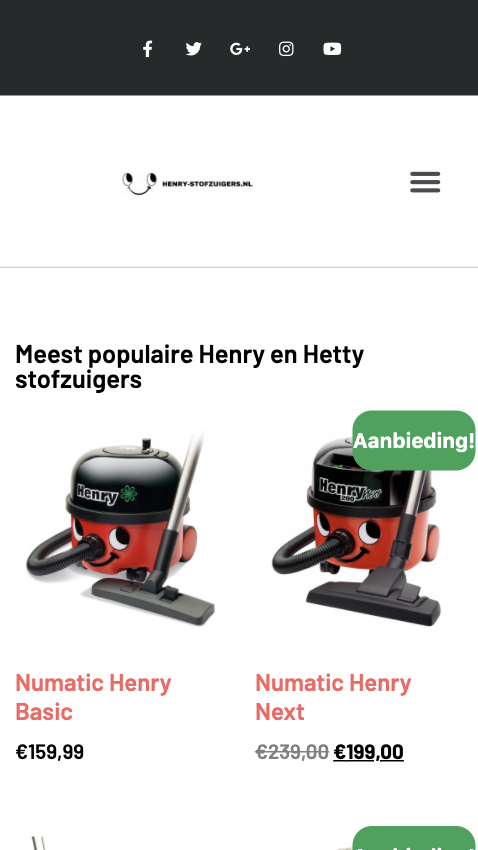

# Procesverslag
**Auteur:** -Milou Teeuwen-

Markdown cheat cheet: [Hulp bij het schrijven van Markdown](https://github.com/adam-p/markdown-here/wiki/Markdown-Cheatsheet). Nb. de standaardstructuur en de spartaanse opmaak zijn helemaal prima. Het gaat om de inhoud van je procesverslag. Besteedt de tijd voor pracht en praal aan je website.

## Bronnenlijst
1. -bron 1-
2. -bron 2-
3. -...-

## Eindgesprek (week 7/8)

-dit ging goed & dit was lastig-

**Screenshot(s):**

-screenshot(s) van je eindresultaat-

## Voortgang 3 (week 6)

-same as voortgang 1-

## Voortgang 2 (week 5)

-same as voortgang 1-

## Voortgang 1 (week 3)

### Stand van zaken

-dit ging goed & dit was lastig-

**Screenshot(s):**

-screenshot(s) van hoe ver je bent-

### Agenda voor meeting

-samen met je groepje opstellen-

### Verslag van meeting

-na afloop snel uitkomsten vastleggen-

## Intake (week 1)

**Je startniveau:** -blauw-

**Je focus:** -responsive-

**Je opdracht:** -https://www.mms.com/nl-nl/?gclid=Cj0KCQjw7sz6BRDYARIsAPHzrNLqJL7BIx9NYYniXHDVMPwQVjh6jtX9YL0RQXw_6D-J8PQnyBZk_d8aAj4JEALw_wcB-- (twijfel)

--https://www.dierenbescherming.nl/-- (deze het liefst)

**Screenshot(s):**

## les 1 (week 1)
**voortgang/uitdaging**
ik kies voor deze website omdat ik heel veel van dieren hou, en de site wel een opknap beurt kan gebruiken. De dingen die ik wil verbeteren zijn de vierkante blokken en weinige afbeeldingen. de slider in het begin met doneer nu zou ik graag zelf kunnen maken. Verder denk ik dat de uitdaging zit in de site mooier maken. ik had in het begin gekozen voor de apple site, maar de kans dat ik dat niet volledig na kan maken is heel groot. Door een website te kiezen die ik kan verbeteren denk ik dat ik er meer energie uit haal. In de typografie oefening heb ik veel geoefend met line-height wat ik in mijn opdracht graag wil gebruiken, de text-shadow vond ik ook vet, maar ik denk dat ik in de site die ik na wil maken er niet zo veel aan heb. Verder had ik eigenlijk niet zo veel struggles nog bij de eerste opdracht. De posters daarintegen had ik wel moeite mee omdat ik niet echt zo goed wist waar ik moest beginnen, ik heb hierdoor 2 posters af gekregen.

**Breakdown-schets(en):**

## les 2 (week 2)
2e werkgroep, we gingen aan de slag met positionering en ik vond het super goed gaan toen ik de opgaven maakte, ik wilde het toe gaan passen op mijn site, maar het lukte niet. vervolgens heb ik voor werkgroep 3 een gesprekje aangekaart helaas alleen bijgelopen met het procesboek en de opdrachten en nog niet begonnen met de site.

## les 3 (week 2)
3e werkgroep, gesprekje gehad met Danny. Vind het gewoon heel lastig en vooral omdat we wel steeds verder gaan met tijd en oefeningen alleen ik niks aan de site die ik heb heb kunnen doen. Ik heb de hele middag sites bezocht en heb gekeken naar een site die ik kan verbeteren. Nu heb ik de henry stofzuiger site gekozen. Ik heb het idee dat ik hiermee wel wat meer kan. Ik wil kijken of ik iets met css kan zoals animatie van kleine opjecten. Ik heb wel de stap gezet om even iemand in te schakelen die me even met het begin kan helpen volgende week heb ik een uurtje een afspraak, ik merk gewoon dat ik met alle vakken prima ga, maar met dit vak zoveel opstart problemen heb. Niet zo zeer dat ik geen motivatie heb want ik denk dat wel de meeste uren hierin zitten, alleen ik ben er gewoon niet zo goed in.

## maandag 13 sep
Het loopt allemaal niet lekker met de site dus ik heb gekozen voor een nieuwe site. In plaats dat ik ga voor responsive wil ik mij denk toch meer verdiepen in de interactie, dat lijkt me leuker om te doen. Ik wil de site verbeteren want hoe die nu is is hij heel saai en lelijk. Ik wil mijn eigen draai eraan geven.

## les 4 (week 3)
4e werkgroep, Ik heb na het gesprek met Danny gezocht naar een andere site en ik ben begonnen om de basis neer te zetten in html. Dat ging wel prima. Hierna ben ik voor een deel aan de slag gegaan met css. Dit ging wel goed in het begin maar ik had uiteindelijk wel puntjes waar ik in vast liep zoals de header waarvan ik de afbeeldingen niet dicht tegen elkaar aan krijg en de stofzuiger foto's die wel naast elkaar komen maar de tekst die er niet vanaf breekt. Ik heb woensdag bijles en dan hoop ik dat ik bij mijn problemen geholpen word.

## les 4 (week 3)
24 september, er is een extra vragenuurtje ingeplant dus natuurlijk meteen mijn kans gegrepen op hulp te krijgen. Ik was in de les de enige dus had 2 student assistenten en Danny die me hielpen. Ze hebben mij geholpen om de header sticky te maken en de flexbox van de stofzuigers te helpen. Ik liep vast, maar was kennelijk al bijna klaar want bij de header miste een ";" en bij de stofzuigers dacht ik dat ik iets al gedaan had wat niet werkte, maar dat werkte kennelijk wel alleen had ik hem niet op de Parent maar op de children gezet waardoor hij de verkeerde had aangepast.

## les 5 (week 4)
28 september, werkgroep 5, ik heb het laatste deel van werkgroep a gevolgd. Hierin werd het beoordelingsformulier behandeld voor de toetsing, verder heb ik het eerste deel van werkgroep b gevolgd over wanneer je transformatie gebruikt en wanneer animatie. Ik was naar Texel voor de verjaardag van mijn moeder vandaar dat ik er deze les niet helemaal bij was.

## 30 september (week 4)
30 september had ik slb, maar naar de les nog even naar Danny gegaan om een paar vragen te stellen.
ook heb ik even naar het beoordelingsformulier met hem gekeken en met de antwoorden ben ik wel iets rustiger geworden. Ook de oefeningen van javascript gemaakt, ik ben er niet meer zo bang voor. Gekeken naar het hamburger menu, maar het lukt me niet om de 2e ul te selecteren dus even in teams gevraagd welke selecteer ik het beste kan gebruiken. Uiteindelijk door gegaan, maar loop helemaal vast, 10 keer de code gecheckt en zou niet weten waarom het niet zou werken...

